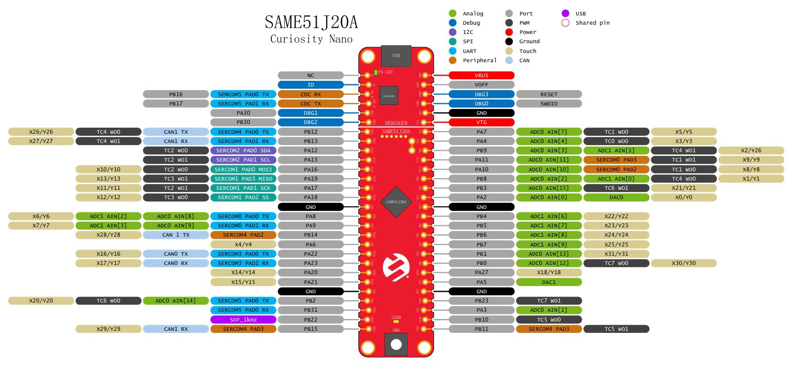

.. zephyr:board:: same51_cnano

Overview
********

The SAME51J20A Curiosity Nano Evaluation Kit (EV76S68A) is a hardware
platform used to evaluate the SAME51J20A microcontroller (MCU), and
it is supported by the MPLAB® X Integrated Development Environment (IDE).
The evaluation kit provides easy access to the features of the
SAME51J20A to integrate the device into a custom design. The Curiosity
Nano series of evaluation kits includes an On-Board Nano Debugger,
therefore no external tools are necessary to program the SAME51J20A
device.

Hardware
********

- SAME51J20A microcontroller
- One user LED (yellow)
- One mechanical user switch
- On-board debugger
   – Board identification in MPLAB X IDE
   – One Green power/status LED
   – Programming and debugging
   – Virtual COM port (CDC)
   – One logic analyzer (DGI GPIO)
- USB powered
- Adjustable target voltage
   – MIC5353 LDO regulator controlled by the on-board debugger
   – 1.8-3.6v output voltage
   – 500 mA maximum output current

Supported Features
==================

The same51_cnano board configuration supports the following hardware
features:

+---------------+------------+----------------------------+
| Interface     | Controller | Driver/Component           |
+===============+============+============================+
| ADC           | on-chip    | adc                        |
+---------------+------------+----------------------------+
| DAC           | on-chip    | dac                        |
+---------------+------------+----------------------------+
| DMAC          | on-chip    | dma                        |
+---------------+------------+----------------------------+
| EIC           | on-chip    | interrupt_controller       |
+---------------+------------+----------------------------+
| GPIO          | on-chip    | gpio                       |
+---------------+------------+----------------------------+
| MPU           | on-chip    | arch/arm                   |
+---------------+------------+----------------------------+
| NVIC          | on-chip    | arch/arm                   |
+---------------+------------+----------------------------+
| NVMCTRL       | on-chip    | flash                      |
+---------------+------------+----------------------------+
| PORT          | on-chip    | pinctrl                    |
+---------------+------------+----------------------------+
| RTC           | on-chip    | timer                      |
+---------------+------------+----------------------------+
| SERCOM I2C    | on-chip    | i2c                        |
+---------------+------------+----------------------------+
| SERCOM SPI    | on-chip    | spi                        |
+---------------+------------+----------------------------+
| SERCOM USART  | on-chip    | serial, console            |
+---------------+------------+----------------------------+
| Serial Number | on-chip    | hwinfo                     |
+---------------+------------+----------------------------+
| SYSTICK       | on-chip    | timer                      |
+---------------+------------+----------------------------+
| TC            | on-chip    | counter                    |
+---------------+------------+----------------------------+
| TCC           | on-chip    | counter, pwm               |
+---------------+------------+----------------------------+
| TRNG          | on-chip    | entropy                    |
+---------------+------------+----------------------------+
| USB           | on-chip    | usb                        |
+---------------+------------+----------------------------+
| WDT           | on-chip    | watchdog                   |
+---------------+------------+----------------------------+

Other hardware features are not currently supported by Zephyr.

The default configuration can be found in the Kconfig
:zephyr_file:`boards/atmel/sam0/same51_cnano/same51_cnano_defconfig`.

Pin Mapping
===========

The SAM E51 Curiosity Nano evaluation kit has 4 GPIO controllers. These
controllers are responsible for pin muxing, input/output, pull-up, etc.

For more details please refer to `SAM D5x/E5x Family Datasheet`_ and the `SAM E51
Curiosity Nano Schematic`_.

Default Zephyr Peripheral Mapping:
----------------------------------
- SERCOM2 USART TX : PB24
- SERCOM2 USART RX : PB25
- GPIO/PWM LED0    : PC18
- GPIO SW0         : PB31
- SERCOM4 SPI SCK  : PB26
- SERCOM4 SPI MOSI : PB27
- SERCOM4 SPI MISO : PB29
- SERCOM7 I2C SDA  : PD08
- SERCOM7 I2C SCL  : PD09
- USB DP           : PA25
- USB DM           : PA24

System Clock
============

The SAME51 MCU is configured to use the 32.768 kHz external oscillator
with the on-chip PLL generating the 48 MHz system clock.

Serial Port
===========

The SAME51 MCU has 8 SERCOM based USARTs with one configured as USARTs in
this BSP. SERCOM2 is the default Zephyr console.

- SERCOM2 115200 8n1 connected to the onboard Atmel Embedded Debugger (EDBG)

PWM
===

The SAME51 MCU has 5 TCC based PWM units with up to 6 outputs each and a period
of 24 bits or 16 bits.  If :code:`CONFIG_PWM_SAM0_TCC` is enabled then LED0 is
driven by TCC0 instead of by GPIO.

SPI Port
========

The SAME51 MCU has 8 SERCOM based SPIs.

I2C Port
========

The SAME51 MCU has 8 SERCOM based I2Cs.

Programming and Debugging
*************************

The SAM E51 Curiosity Nano comes with a Atmel Embedded Debugger (EDBG).  This
provides a debug interface to the SAME51 chip and is supported by
OpenOCD.

Flashing
========

#. Build the Zephyr kernel and the ``hello_world`` sample application:

   .. zephyr-app-commands::
      :zephyr-app: samples/hello_world
      :board: same51_cnano
      :goals: build
      :compact:

#. Connect the SAM E51 Curiosity Nano to your host computer using the USB debug
   port.

#. Run your favorite terminal program to listen for output. Under Linux the
   terminal should be :code:`/dev/ttyACM0`. For example:

   .. code-block:: console

      $ minicom -D /dev/ttyACM0 -o

   The -o option tells minicom not to send the modem initialization
   string. Connection should be configured as follows:

   - Speed: 115200
   - Data: 8 bits
   - Parity: None
   - Stop bits: 1

#. To flash an image:

   .. zephyr-app-commands::
      :zephyr-app: samples/hello_world
      :board: same51_cnano
      :goals: flash
      :compact:

   You should see "Hello World! same51_cnano" in your terminal.

References
**********

.. target-notes::

.. _Microchip website:
    http://www.microchip.com/DevelopmentTools/ProductDetails.aspx?PartNO=ATSAME51-CNANO

.. _SAM D5x/E5x Family Datasheet:
    http://ww1.microchip.com/downloads/en/DeviceDoc/60001507M.pdf

.. _SAM E51 Curiosity Nano Schematic:
    http://ww1.microchip.com/downloads/en/DeviceDoc/SAM-E51-Curiosity-Nano-Evaluation-Kit-Design-Documentation.zip
